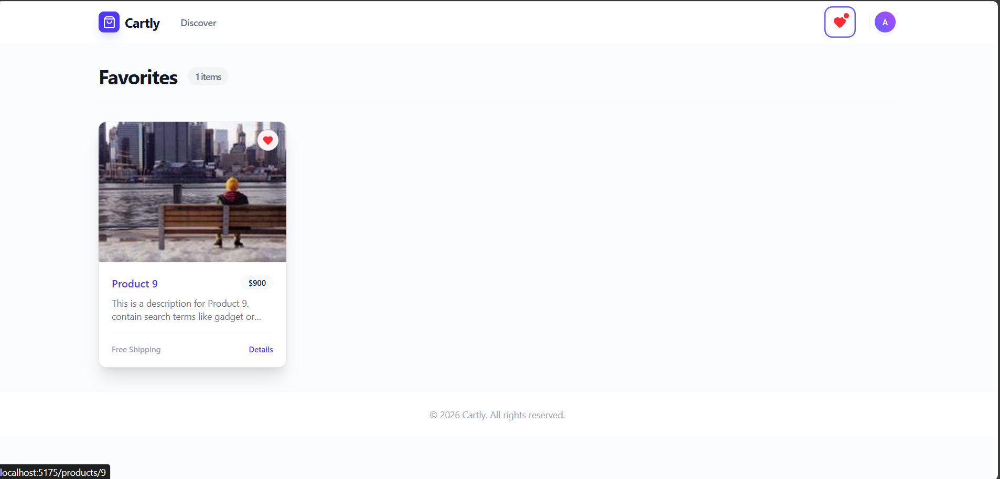
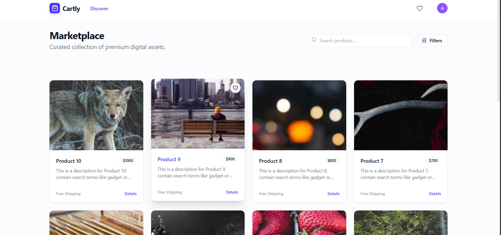
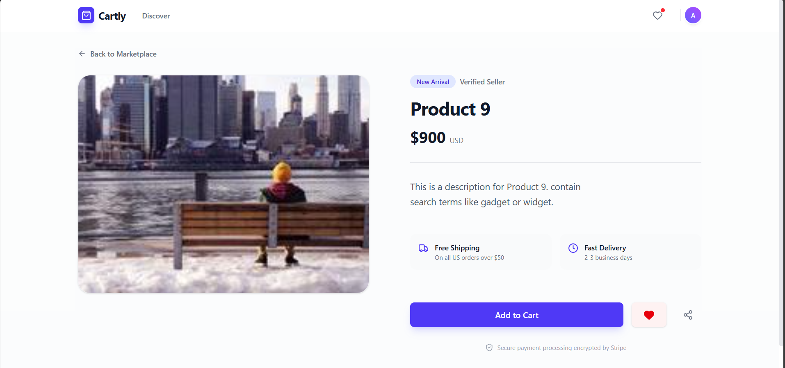
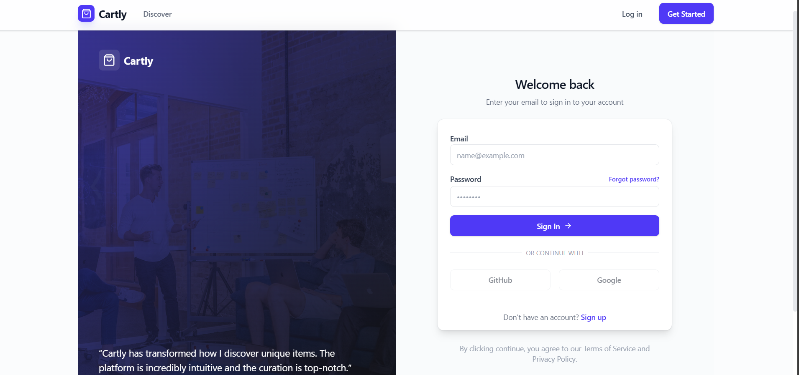
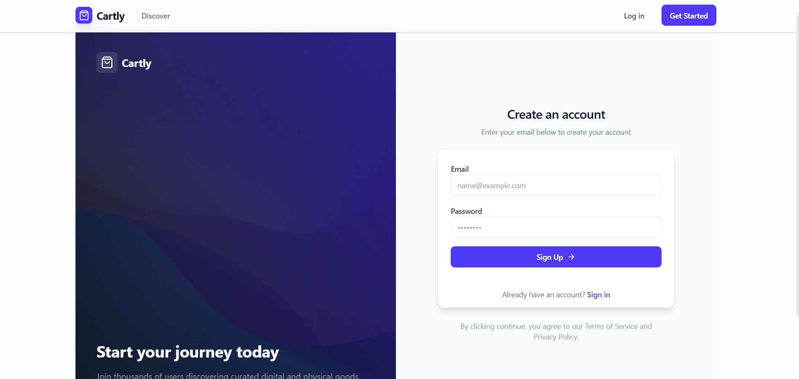

# Cartly Marketplace App

A full-stack marketplace application built with Node.js, Express, React, and TailwindCSS.

## Features
- **User Authentication**: Register and Login with JWT.
- **Product Management**: Browse products with pagination and search.
- **Favorites**: Users can add products to their favorites list.
- **Modern UI**: Clean, responsive interface built with TailwindCSS.

## Project Structure
- `backend/`: Node.js + Express API + Prisma (SQLite)
- `web/`: React + Vite Frontend

## Setup Instructions

### Prerequisites
- Node.js (v18+)
- npm

### 1. Backend Setup
```bash
cd backend
npm install
npx prisma migrate dev --name init
node prisma/seed.js  # Seeds 2 users and 10 products
npm run dev
```
The backend will run on `http://localhost:3000`.

**Default Users:**
- `alice@example.com` / `password123`
- `bob@example.com` / `password123`

### 2. Frontend Setup
```bash
cd web
npm install
npm run dev
```
The frontend will run on `http://localhost:5173`.

## API Endpoints

### Auth
- `POST /auth/register`: Create account
- `POST /auth/login`: Login
- `GET /auth/me`: Get current user profile

### Products
- `GET /products`: List products (query params: `search`, `page`, `limit`)
- `GET /products/:id`: Get product details
- `POST /products`: Create product (Protected)
- `POST /products/:id/favorite`: Toggle favorite (Protected)

## Tech Stack
- **Backend**: Node.js, Express, Prisma, SQLite, Zod, JWT, BCrypt
- **Frontend**: React, Vite, TailwindCSS, Axios, React Router, Lucide React

## Known Issues & Limitations
- **Search**: Currently case-insensitive by default on SQLite. For PostgreSQL production deployment, `mode: 'insensitive'` should be added to Prisma queries.
- **Favorites**: Toggling a favorite triggers a full user profile refetch (`/auth/me`) instead of an optimistic UI update. This was a trade-off for data consistency in the MVP.
- **Seeding**: The `seed.js` script is not idempotent. Running it multiple times will create duplicate products.
- **Rate Limiting**: API endpoints currently lack rate limiting, which would be added for a production release.


## Screenshots

**Favorites**


**Marketplace**


**Product Details**


**Login**


**Register**
